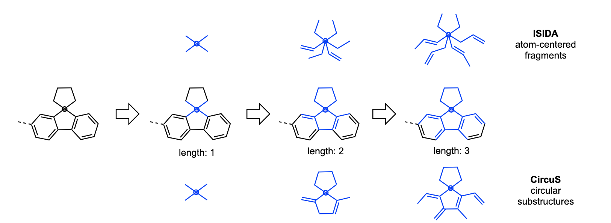
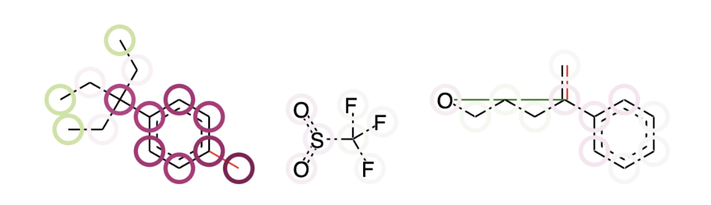

DOPtools
=============

Overview
=============

DOPtools library contains tools for working with molecules and reaction in machine learning and data analysis applications.

* CircuS and Chyline descriptors and the code to calculate them,
* Calculators for fingerprints and Mordred, implemented as SKLearn compatible classes,
* ComplexFragmentor as a tool to concatenate descriptors of several structures into one table,
* ColorAtom implementation in Python, usable with CircuS desciriptors,
* Scripts for CLI descriptor calculation and model optimization.

Installation
=============

Package can be installed from PyPI:

    pip install doptools

Otherwise, if downloaded from github, activate your virtual environment with python 3.9+ , clone project and cd into the DOPtools folder, then run

    pip install -U -e .

Requirements
============

The requirements are listed in setup.py and should be installed with the library.

The main requirement is Chython library (https://github.com/chython/chython), as calculation of molecular descriptors and ColorAtom are based on it.

Calculation of molecular descriptors is organized as a scikit-learn transformer class, therefore, pandas and scikit-learn libraries are required.

CircuS descriptors
==================

The descriptors are implemented using CGRtools library and its native substructure extraction functions. Their functionality is the following. The user indicates the desired lower and upper limits for the size of substructures, as the topological radius (number of bonds from a certain atom). Size of 0 means only atom itself, size of 1 – atom and all atoms directly connected to it, and so on. It should be noted that due to the way how substructure extraction is implemented in CGRtools library, the size means the number of atoms from the center, and all the bonds between selected atoms will be present, which may be slightly counterintuitive (see an example for a 5-member ring below). This is repeated for all atoms in the molecule/CGR and for all sizes from lower to upper limit to construct the fragment table.

The calculation of CircuS descriptors is done by the ChythonCircus class in the chem_features module. As an extension of scikit-learn transformer class, it can take alist, an array, or pandas Series containing the molecules and perform the fragmentation, resultsing in a pandas DataFrame of descriptors. The required parameters are the lower and upper limits of the size, format of the input molecules (CGRtools MoleculeContainer or CGRContainer or SMILES), and whether or not the CGR will be processed by taking into account only dynamic objects or not. *fit* and *transform* functions are used as usual. The feature names (SMILES of the fragments) can be accessed after training ia *get_feature_names* function. 

ComplexFragmentor
==================

ComplexFragmentor class is a scikit-learn compatible transformer that concatenates the features according to specified associations. The most important argument is the *associator* - a dictionary that establishes the correspondence between a column in a data frame X and the transformer that is trained on it.

For example, say you have a data frame with molecules/CGRs in one column ("molecules"), and solvents in another ("solvent"). You want to generate a feture table that includes both structural and solvent descriptors. You would define a ComplexFragmentor class with associator as a dictionary, where keys are column names, and value are the corresponding feature generators. In this case, e.g.,

    associator = {"molecules": ChythonCircus(lower=a, upper=b), "solvent":SolventVectorizer()}  

ComplexFragmentor assumes that at least one of the types of features will be structural, thus, *structure_columns* parameter defines the columns of the data frame where structures are found.

ColorAtom
=========

ColorAtom class implements the approach of calculating atomic contributions to the prediction by a model built using fragment descriptors. In this approach, the weights of all fragments are calculated as partial derivatives of the model’s prediction. To get the weight for one fragment, a new descriptor vector is constructed, where the value of this fragment is different (usually by value of 1 for easier calculation), the property is predicted, and the difference in predictions is taken as the weight. Each atom involved in this fragment accumulates this weight as the score, and the sum of all scores on the atom indicates its importance. This can then be visualized, by assigning colors to positive and negative colors, thus allowing to visually inspect the atomic contributions and draw conclusions which modifications to the structure may be beneficial for further improvement of the studies property.

The approach is developed and reported in 

 G. Marcou, D. Horvath, V. Solov’ev, A. Arrault, P. Vayer and A. Varnek
 Interpretability of SAR/QSAR models of any complexity by atomic contributions
 Mol. Inf., 2012, 31(9), 639-642, 2012

Current implementation is designed for regression tasks, for models built with Scikit-learn library and using ISIDA fragments implemented in CIMtools or CircuS fragments implemented in chem_features module of this library. 

The application of the ColorAtom requires a trained pipeline containing a fragmentor (CircuS are supported), features preprocessing and a model. *calculate_atom_contributions* calculates the contributions of each atom for a given molecule and returns them numerically as a dictionary. Otherwise, they can visualized directly in Jupyter Notebook via *output_html* function that returns an HTML table containing an SVG for each structure in the molecule. Since complexFragmentor is also supported, several structures in one data point can be processed simultaneously. 

The coloring is done with matplotlib library. The atom contributions are normalized between 0 and 1 according to the maximum absolute value of the contribution. Therefore, if several structures are present, they will all have their colors normalized by the maximum value amond all contributions. The default colormap is PiYG. The "lower" (more negative) contributions are shown by red color, the "upper" (more positive) - by green. An example can be seen below:

